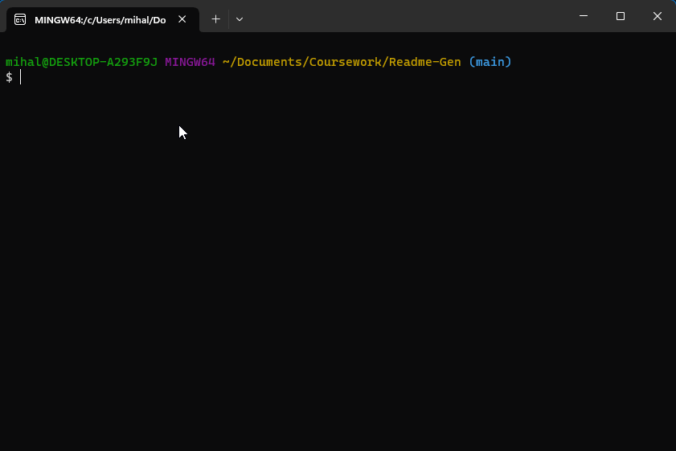

# README-GEN

## Table of Contents
 - [Description](#description)
 - [Installation](#installation)
 - [Usage](#usage)
 - [Contributing](#contributing)
 - [Testing](#testing)
 - [Questions](#questions)
 - [Contact](#contact)
 - [License](#license)

## Description
I wanted to make an easy-to-use README generator. It uses npm's "inquirer" package to prompt the user for the information, then creates and structures a README.md file. My hope was to make a simple tool that generates a README for any project without the user having to write everything in markdown.

## Installation
In a terminal, run "npm install" from the root directory of the project, and when that finishes run "node index.js".

## Usage
Run the index file with node, then follow the prompts on the command-line to fill in your section text. If you would like to omit a section, simply press the enter key to skip that section and it will be passed over when generating. The resulting markdown file will be generated in the "/output" folder and will be named README.md, meaning each use of the tool will overwrite the last generated README. 

## Contributing
Be happy and do code.

## Testing
Write a testing script using Jest

## Questions

FAQ:
There are currently no FAQs

- GitHub Profile: [IkonicRes](https://github.com/IkonicRes)

- For additional questions, reach out to Ikonicresonance@gmail.com.

## Contact

Preferred method of communication: Github

## License

MIT License

    Permission is hereby granted, free of charge, to any person obtaining a copy of this software and associated documentation files (the "Software"), to deal in the Software without restriction, including without limitation the rights to use, copy, modify, merge, publish, distribute, sublicense, and/or sell copies of the Software, and to permit persons to whom the Software is furnished to do so, subject to the following conditions: The above copyright notice and this permission notice shall be included in all copies or substantial portions of the Software. THE SOFTWARE IS PROVIDED "AS IS", WITHOUT WARRANTY OF ANY KIND, EXPRESS OR IMPLIED, INCLUDING BUT NOT LIMITED TO THE WARRANTIES OF MERCHANTABILITY, FITNESS FOR A PARTICULAR PURPOSE AND NONINFRINGEMENT. IN NO EVENT SHALL THE AUTHORS OR COPYRIGHT HOLDERS BE LIABLE FOR ANY CLAIM, DAMAGES OR OTHER LIABILITY, WHETHER IN AN ACTION OF CONTRACT, TORT OR OTHERWISE, ARISING FROM, OUT OF OR IN CONNECTION WITH THE SOFTWARE OR THE USE OR OTHER DEALINGS IN THE SOFTWARE.

